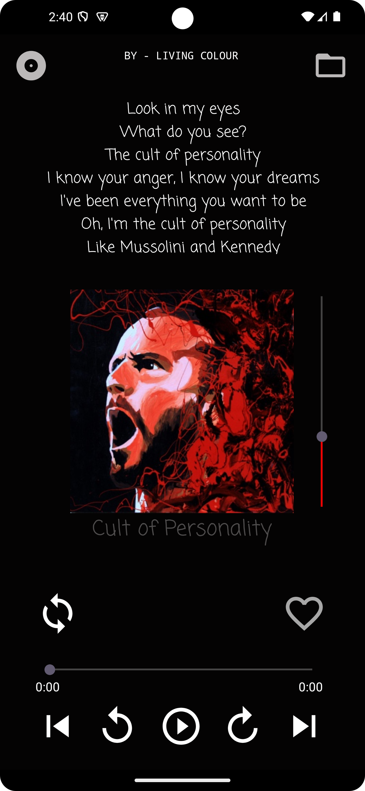

# Music Streaming App

This **Music Streaming App** is an Android-based application that allows users to stream music directly from their devices. The app provides multiple screens for navigating and managing music playlists, browsing songs, and playing tracks with a simple and user-friendly interface.

## Features
- **Play Music**: Users can stream their favorite songs directly through the app.
- **Multiple Screens**: The app includes several screens for different functionalities, such as browsing songs, viewing playlists, and managing music data.
- **Simple UI**: The app features a clean and intuitive user interface to ensure a seamless music streaming experience.

## File Structure
- **MainActivity.java**: The main entry point of the application where the core functionality is implemented.
- **MainActivity2.java & MainActivity3.java**: Additional activities that provide extended features or alternative views within the app.
- **data.java**: Manages the app's data, possibly including music information or user preferences.
- **XML Layout Files**: 
  - **activity_main.xml**: Defines the UI components of the main screen.
  - **activity_main2.xml** and **activity_main3.xml**: Layouts corresponding to the secondary activities for extended functionality.

## Installation
To set up and run this project, follow the steps below:

1. Open **Android Studio** and create a new project with **Empty Activity**.
2. Once the project is created, navigate to the **app/src/main/java** folder and replace the contents of the **MainActivity.java** with the provided Java files:
   - **MainActivity.java**
   - **MainActivity2.java**
   - **MainActivity3.java**
   - **data.java**

3. Similarly, copy the provided **XML layout files** to the **res/layout** folder in your new Android Studio project:
   - **activity_main.xml**
   - **activity_main2.xml**
   - **activity_main3.xml**

4. Ensure that your **AndroidManifest.xml** is updated to reflect the newly added activities if necessary.
   
5. Build and run the project on an Android emulator or physical device.

## Contributions
Contributions are welcome! Feel free to submit pull requests to improve functionality, fix bugs, or add new features.

## License
This project is licensed under the MIT License. See the [LICENSE](LICENSE) file for more details.

## Screenshots

